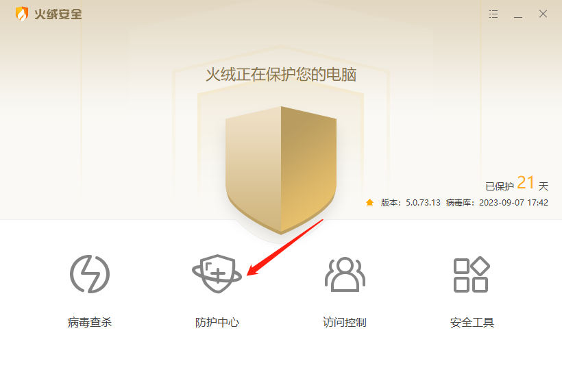
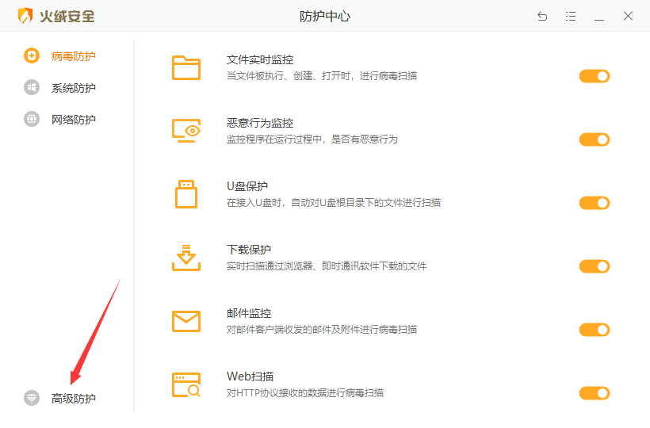
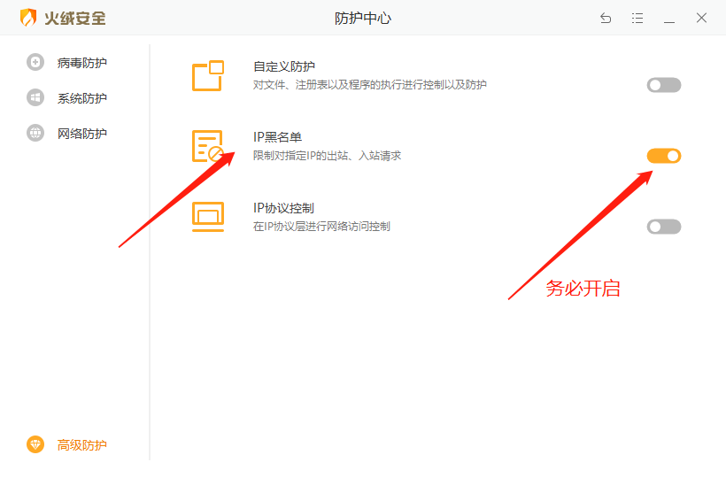
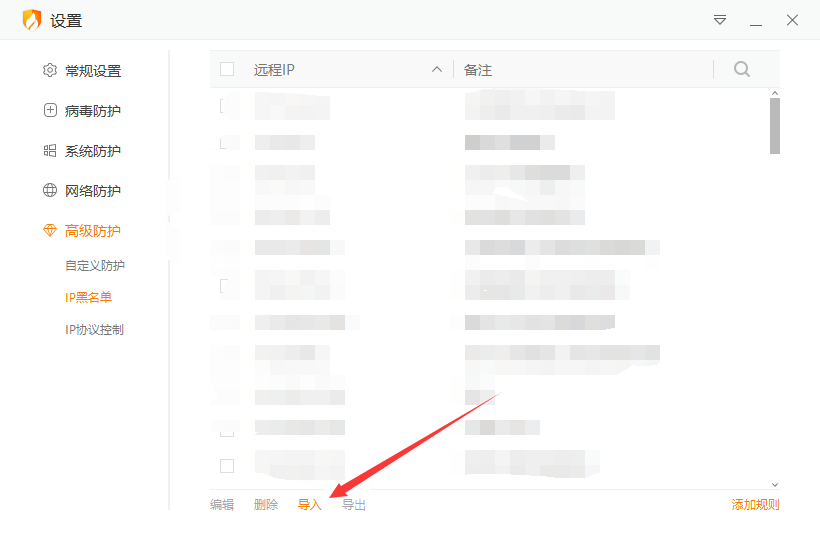

## 简介

本项目基于[yxnan/block-l4d2-rpg-servers](https://github.com/yxnan/block-l4d2-rpg-servers)项目构建，增加多个RPG服务器关键词，减少误杀，提高命中。并使用Github Action每日更新列表。

## 更新方式

本项目使用Github Action，自动更新RPG服务器列表，并不定期与[L4D2_RPG_Blocker](https://github.com/razerdp/L4D2_RPG_Blocker)项目成果进行合并。如果出现误报、漏扫、需要升级等情况，请及时联系我([Steam](https://steamcommunity.com/profiles/76561199403165320/)/[lssues](https://github.com/xunpod/l4d2-rpg-server-list/issues)/[邮件](mailto:xunpod@hotmail.com))。

获取地址1：[Github Release](https://github.com/xunpod/l4d2-rpg-server-list/releases/latest/download/rpglist-latest.json)  

获取地址2：[Github加速镜像](https://ghproxy.com/https://github.com/xunpod/l4d2-rpg-server-list/releases/latest/download/rpglist-latest.json)

在Windows与Linux中，使用如下终端命令获取：

```
curl -O https://github.com/xunpod/l4d2-rpg-server-list/releases/latest/download/rpglist-latest.json
```

若与Github的连接不顺畅，也可使用镜像加速：

```
curl -O https://ghproxy.com/https://github.com/xunpod/l4d2-rpg-server-list/releases/latest/download/rpglist-latest.json
```


## 屏蔽方法

### Windows

下载上述的`rpglist-latest.json`，导入火绒或者其他类似能提供IP过滤名单的软件即可。

下面是使用火绒安全软件的屏蔽教程：










### Linux

以Ubuntu为例，安装必备依赖：

```bash
sudo apt update 
sudo apt install jq curl -y
```

导入屏蔽列表`rpglist-latest.json`：

```bash
git clone https://github.com/xunpod/l4d2-rpg-server-list.git
cd l4d2-rpg-server-list
sudo ./iptables-import.sh rpglist-latest.json  
```

OK，现在RPG服务器已经被屏蔽，你将得到一个干净的组列表，并且也不会匹配到它们，甚至使用控制台指令`connect`以及`openserverbrower`也无法连接。

## 自行构建

### 如果你想自行生成屏蔽列表，参考下列步骤

1. 以Ubuntu为例，首先安装必备依赖:

```bash
sudo apt update 
sudo apt install jq curl -y
```

2. 申请一个[SteamWebAPI key](https://steamcommunity.com/dev/apikey)。

3. 运行 `build-rpglist.sh`


```bash
git clone https://github.com/xunpod/l4d2-rpg-server-list.git
cd l4d2-rpg-server-list
./build-rpglist.sh YOUR_API_KEY
```

如果一切顺利，当前目录下会生成`rpglist-latest.json`。

### 如果你想使用Github Action自动生成屏蔽列表，参考下列步骤

1. 申请一个[SteamWebAPI key](https://steamcommunity.com/dev/apikey)。
2. 生成一个[GitHub Tokens(classic)](https://github.com/settings/tokens/new)，用于将更新结果推送到仓库，并生成release。
3. Fork本项目仓库。
4. 在你的仓库/Settings/Security/Secrets and variables/Actions，点击New repository secret，新建两个参数。

|        | 第一个Repository secret   | 第二个Repository secret |
| ------ | ------------------------- | ----------------------- |
| Name   | STEAM_API_KEY             | UPDATE_TOKEN            |
| Secret | 步骤1申请到的SteamAPI KEY | 步骤2生成的Github Token |

自动更新时间为每天零点，可以在`auto-update.yml`中更改。

## 注意事项

1. 每次导入新列表之前，请删除已经导入的旧数据。
2. 由于Steam组服务器年事已高，屏蔽部分服务器IP以后，可能会产生BUG，例如正常的组列表服务器加载不完整，但此时你仍可正常使用控制台指令`connect`以及`openserverbrower`连接服务器。
3. 人力有所不及，代码也是如此，若本项目带来了意料之外的问题，请及时联系我([Steam](https://steamcommunity.com/profiles/76561199403165320/)/[lssues](https://github.com/xunpod/l4d2-rpg-server-list/issues)/[邮件](mailto:xunpod@hotmail.com))。

